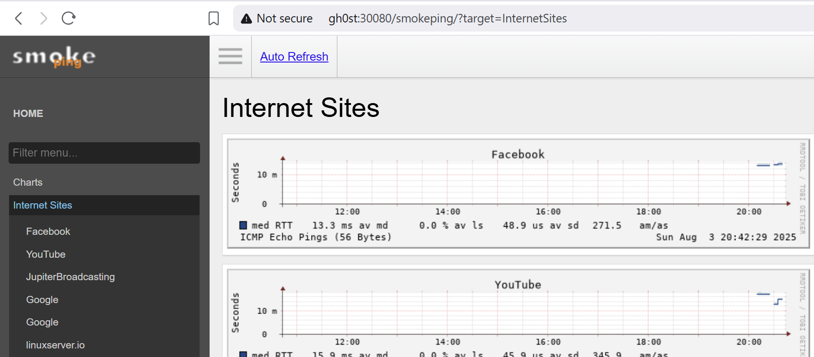

# SmokePing

## Docker-Compose
Vendor provides a Docker-Compose manifest

```
---
services:
  smokeping:
    image: lscr.io/linuxserver/smokeping:latest
    container_name: smokeping
    hostname: smokeping #optional
    environment:
      - PUID=1000
      - PGID=1000
      - TZ=Etc/UTC
      - MASTER_URL=http://<master-host-ip>:80/smokeping/ #optional
      - SHARED_SECRET=password #optional
      - CACHE_DIR=/tmp #optional
    volumes:
      - /path/to/smokeping/config:/config
      - /path/to/smokeping/data:/data
    ports:
      - 80:80
    restart: unless-stopped

```
[Vendor Docs](https://hub.docker.com/r/linuxserver/smokeping)

### Kompose
[Kompose](https://kompose.io/) was used to convert the Docker Compose to K8s manifests
```
../kompose -f docker-compose convert
```

## K8s YAML
Base Kompose output was manually modified to create k8s manifest files contained in this project.

## Deployment Order
1) Create Namespace

``` kubectl create namespace smokeping```

2) Storage - Persistent Volume

``` kubectl apply -f smokeping-pvc-config.yaml```

``` kubectl apply -f smokeping-pvc-data.yaml```

3) Pod deployment

``` kubectl apply -f smokeping-deployment.yaml```

4) Service (NodePort)

``` kubectl apply -f smokeping-service.yam```

## Access
Browse to http://<your-K8s-NodeIP>:30080/smokeping
